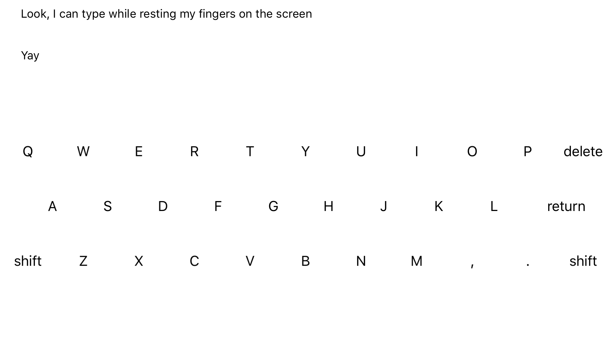

# Force Touch Keyboard

## Screenshot

## Concept

A questionable rumor arised recently about [E Ink keyboards on the 2018 MacBooks](http://www.theverge.com/2016/10/19/13328710/apple-e-ink-keyboard-macbook-sonder-rumors). That brought me to wondering how reasonable a Touch Bar-like technology that replaces the whole keyboard of the MacBook would be if it used haptic feedback to simulate physical clicks (similar to the new trackpads or the home button on the iPhone 7).

To test this, I developed this little demonstration using a combination of 3D touch and haptic feedback on the iPhone 7 to create a full QWERTY keyboard with simuated key presses. This means that you can rest your fingers on the screen without having the keyboard freak out, like on a normal touchscreen keyboard. When you want to type a key, simply press harder to type – just like you would on a normal keybaord. The pressure sensitivity has been matched approximately to what it feels like on my 2014 MacBook Pro (with the old keyboard style).

_Note: An iPhone 6S is required to use this due to the use of 3D touch. Works best with an iPhone 7 to take advantage of haptic feedback for pseudo-physical clicks._

## Results

Sadly, at the time of writing this, iPads do not support 3D touch or haptic feedback, so the best I can do is to test it on an iPhone 7 Plus. Additionally, the iPhones can only track 5 touches at a time (while the 9.7" iPad can track 11 and the 12.9" iPad can track 16). This means that you can't rest all of your fingers on the screen at the same time, like you typically would on a normal keybaord. Once you get over the cramped space and having to hover a few of your fingers, the physical click effect is fairly convincing and seems to work surprisingly well.

However, one concern with emulating this technology on the MacBooks is that they have a much larger surface area in which the user would be typing. This would required multiple Taptic engines to be placed under the glass. Additionally, the bumps on the F and J keys and the ability to feel spacing between keys are essential to any touch typer. One potential approach to solving this issue would be to implement [virtual](http://techland.time.com/2013/10/09/disney-just-figured-out-virtual-textures-letting-you-feel-bumps-and-ridges-on-a-touchscreen/) [textures](https://www.disneyresearch.com/project/teslatouch/), yet I do not know how accurate this technology is at simulating this.

## License

MIT

## Authors

[Nathan Flurry](https://twitter.com/NathanFlurry) - [nathanflurry.com](http://nathanflurry.com)
